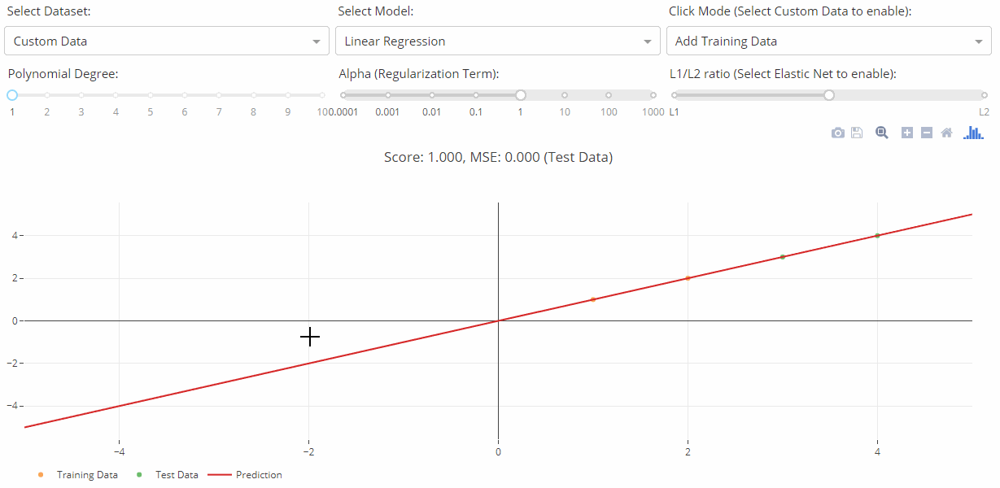

# Regression Explorer

This is a demo of the Dash interactive Python framework developed by [Plotly](https://plot.ly/).

Dash abstracts away all of the technologies and protocols required to build an interactive web-based application and is a simple and effective way to bind a user interface around your Python code.

To learn more check out our [documentation](https://plot.ly/dash).

You can find the latest [dev version of the app here](https://dash-regression-dev.herokuapp.com/),
and the [official version here](https://dash-regression.herokuapp.com/).

## Getting Started with the Demo
This demo lets you interactive explore different linear regression models. [Read more about Linear Models here](http://scikit-learn.org/stable/modules/linear_model.html#linear-model).

The Dataset dropdown lets you select different toy datasets with added noise.

The model dropdown lets you select different types of models. Linear Regression is the regular Least Square model, whereas the other ones are regularized models.

The Polynomial Degree slider lets you control how many polynomial degree do you want to use to fit your data. This will create a non-linear regression, at the risk of overfitting.

The Alpha Slider lets you control the regularization term, which penalizes large coefficient terms. This lets you control the variance and bias of your model.

L1/L2 ratio is for the Elastic Net model, and control the weight of each norm.

## How does it work?
This app is fully written in Dash + scikit-learn. All the components are used as input parameters for scikit-learn or numpy functions, which then generates a model with respect to the parameters you changed. The model is then used to perform predictions that are displayed as a line plot. The combination of those two library lets you quickly write high-level, concise code.

## Screenshots
